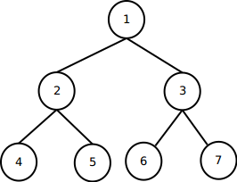
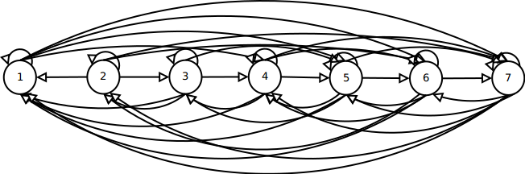

## 22.1 Graph Representation {#22-1-graph-representation}

For given **Graph** \(**G**\) consisted by two fundamental elements: **Vertex** \(**V**\) and **Edge** \(**E**\), so we call a graph equivalent to **G=\(V,** **E**\)**. **Vertex is how many destination while edge is how many possible \(or allowed\) path to travel into all vertex.There are two type of graph**: undirected graph **and** directed graph. **There are two known data structure to represent graph**: Matrix Adjacency **using array has size Θ\(V2\), but has Ο\(1\) to do searching ** **and **List adjacency** using linked list that has size Θ\(E\), but has Ο\(V\) to do searching.

In the practice, there is no one best way to implementing vertex and index because the implementation is depend on programming language which used to built program. For example, some programming may used class to represent vertex in object oriented programming using java.

22.1-1 Given an adjacency-list represent of a directed graph, how long does it take to compute the out-degree of every vertex? How long does it take to compute the in-degrees?

Out-degree is number of outward edges from given vertex. Compute out-degree take Ο\(E\). In-degree is number of inward edges into given vertex. Compute out-degree take Ο\(E\*V\).

22.1-2 Give an adjacency-list representation for a complete binary tree on 7 vertices. Give an equivalent adjacency-matrix representation. Assume that vertices are numbered from 1 to 7 as in binary heap.

|  | {1 → 2 → 3}, {2 → 4 → 5}, {3 → 6 → 7} |  |
| --- | --- | --- |


22.1-3 The **transpose** of directed graph G = \(V, E\) is graph G^T= \(V, E^T\), where . Thus G^T is G with all its edges reversed. Describe efficient algorithms for computing G^T from G, for both the adjacency-list and adjacency-matrix representations of G. Analyze the running times of your algorithms.

Below, the transpose of 7 vertices from problem 22.1-2:



| {1 → 1 → 4 → 5 → 6 → 7}, {2 → 1 → 2 → 3 → 6 → 7}, {3 → 1 → 2 → 3 → 4 → 5}, {4 → 1 → 3 → 4 → 5 → 6 → 7}, {5 → 1 → 3 → 4 → 5 → 6 → 7}, {6 → 1 → 2 → 4 → 5 → 6 → 7}, {7 → 1 → 2 → 4 → 5 → 6 → 7} |  |
| --- | --- |


Algorithm to transpose adjacency matrix:

```
for i = 0 to V-1:
    for j = 0 to V-1:
        if AdjMatrix[i][j] == 0:
            AdjMatrix[i][j] = 1
        else:
            AdjMatrix[i][j] = 0
```

Running Time: Ο\(V^2\)

Algorithm to transpose adjacency list using priority queue:

```
for i = 0 to (V - 1):
    j = 0

    do:
        v[j] = dequeue(node[i])
        j++
    while(v[j-1] != 0)

    l = 0
    for k = 0 to (V - 1):
        if (k+1 is not v[l]) or (tmp[l] is 0):
            enqueue(node[i], k+1)
        else:
            if l < j:
                l++
```

Running Time: Ο\(2V^2\)

