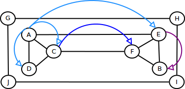

## 22.2 Breath First Search (BFS) {#22-2-breath-first-search-bfs}

BFS is categorized as blind search algorithm. BFS read all neighbor of current vertex until reach vertex that has no neighborhood. In tree representation, BFS will traversing from root into each level of tree until reach leaf. Since this algorithm need to traversing into each level of tree, it need to store every vertex in current level into memory. To avoid restore or visit already visited vertex, we need to marked every vertex that just visited. Thus running time of this algorithm is Ο(V+E).

Take a look for a graph below:

If we want to traversing a path which started from vertex A, BFS will show you A-D-C-E-F-B. Notice, we need to scan all child of current vertex. Queue commonly used to store all child of current vertex, after all child stored and marked, then we dequeue each stored child of last vertex as current vertex and iterate over its child. That’s pretty easy.