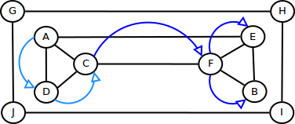

## 22.3 Depth First Search (DFS) {#22-3-depth-first-search-dfs}

DFS is categorized as blind search algorithm. DFS read all vertex that connected directly with current vertex until all vertex scanned. In tree representation, DFS will walking from root into each first found connected vertex in each level until reach a leaf. This algorithm can be implemented easily using recursive strategy. Because we need to scan all vertex and edge in a path, thus the running time is Ο(V+E).

Take a look for a graph below:

If we want to traversing a path which started from vertex A, DFS will show you A-D-C-F-E-B.